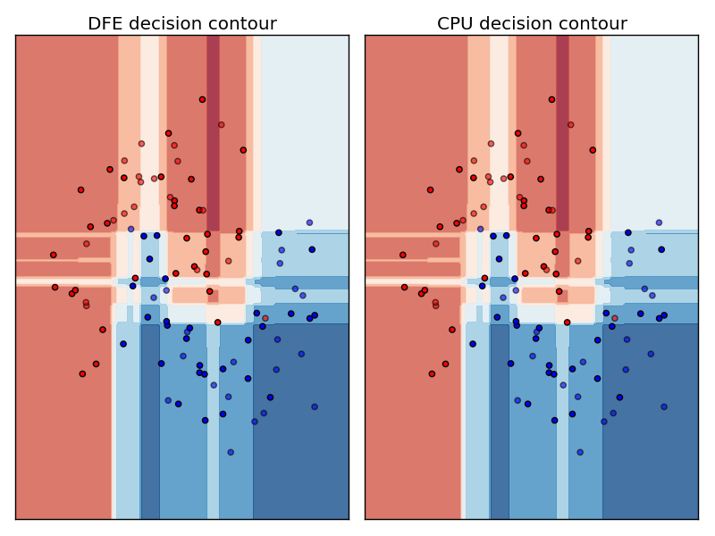

# A Boosted Decision Tree for Maxeler Dataflow Engines

## Example Project
To get started with the example, first:
```
cd CPUCode
python example_train.py
```
This creates a dummy dataset, and trains a BDT to classify it using sklearn.
The BDT is written to `bdt.pkl` so we can use it again in python, and `bdtjson.txt` so we can generate a DFE implementation.
Now build the DFE project:
```
cd RunRules/<Simulation,Maia>
make build
```
Create the SLiC skin:
```
sliccompile -t python -m maxfiles/DFEBDT.max
mv DFEBDT.py _DFEBDT.so simutils/ ../../CPUCode
```
Compare the sklearn `GradientBoostingClassifier.decision_function` output to the DFE, over the whole dataset feature range (as in [the sklearn example](http://scikit-learn.org/stable/auto_examples/classification/plot_classifier_comparison.html)):
```
cd CPUCode
python example_test.py
```


## Custom Project
To make your own low latency BDT predictions, first of all train a BDT with sklearn, and write the JSON file:
```
import bdtToJSON

myBDT = GradientBoostingClassifier()
myBDT.fit(myTrainX, myTrainY)
with open('mybdtjson.txt', 'w') as f:
  f.write(bdtToJSON.toJSON(myBDT))
```
Modify EngineCode/src/BDTManager.maxj to point to your JSON file.
You may also want to change the data type of the features and score in the same file.

## Dependencies
The `maxj` project requires [json-simple](https://github.com/fangyidong/json-simple) and [maxpower](https://github.com/maxeler/maxpower).
Running the example additionally requires python libraries `sklearn`, `numpy`, `matplotlib`, `json`.
